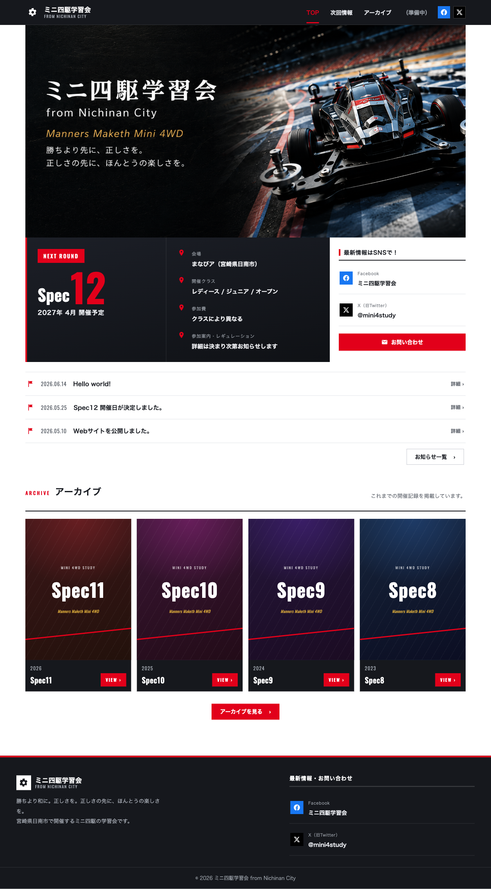
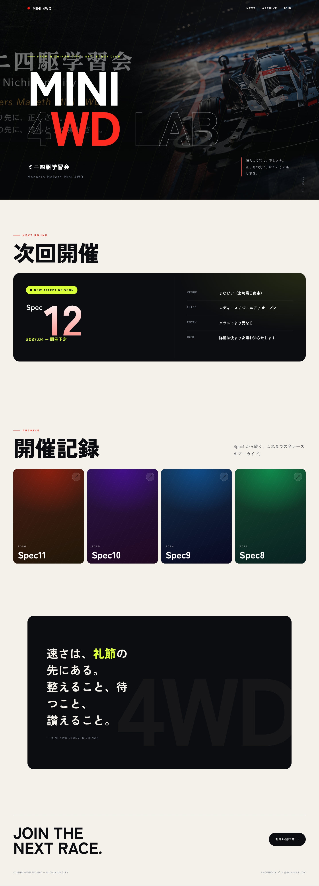
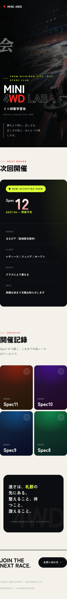

# ミニ四駆学習会 — デザインリニューアル提案

> 現状は「悪くはないが一昔前」「THE WORDPRESS」。本書はその脱却に向けた方向性と具体策、段階的な実装計画をまとめたもの。
> 体感用に動くモックアップ（[`redesign-mockup.html`](./redesign-mockup.html)）を同梱。ブラウザで開くと演出込みで確認できる。

---

## 1. 現状の課題（なぜ「一昔前」に見えるか）

| # | 症状 | 原因 |
|---|------|------|
| 1 | フォントが古い | 見出しの **Oswald**（細めコンデンス体）が2014–16年頃の定番。本文も無印の Hiragino/Noto で字面が平凡。 |
| 2 | 横が狭い・窮屈 | コンテンツ幅 **1120px 固定**＋全要素が同じ幅。`section` padding が 30–52px と詰まっていて余白が足りない。 |
| 3 | WordPressテンプレ感 | セクションが**同じ幅で縦に均一に積まれる**。赤い縦バー＋英字ラベルの見出しが全節で反復し、装飾の手癖が強い。 |
| 4 | 画面が"のっぺり" | 単色面が多く、奥行き・テクスチャ・モーションがほぼ無い。 |
| 5 | スマホでヒーローが弱い | メインビジュアルが**テキスト焼き込み画像(mv.png)** のため、スマホで縮小＝文字が潰れる。文言変更・SEO・多言語にも不利。 |

**現状（PC）**


---

## 2. 提案コンセプト：**Editorial Motorsport**

「レース（速さ・競技）」と「雑誌（余白・大胆なタイポ）」を掛け合わせる。シャープで硬派だった世界観を残しつつ、**情報を減らさず"余白と大きさ"で語る**現代的な見せ方へ。子どもから大人まで、地域コミュニティの温度感も保つ。

キーワード： *大きい・速い・余白・可変フォント・赤×ボルト(ライム)*

**新案（PC）**


**新案（モバイル）**


---

## 3. 具体策（Before → After）

### 3.1 タイポグラフィ（最優先・最も効く）
| 用途 | 現状 | 提案 |
|------|------|------|
| 英字ディスプレイ | Oswald | **Archivo Expanded**（可変・ワイド。`MINI 4WD` 等を特大で。現代的で力強い） |
| 日本語 | Hiragino / Noto Sans JP | **Zen Kaku Gothic New**（字面が今・視認性高・親しみ） |
| 数字／ラベル | Oswald | **Saira**（F1系のテック・スポーツ感。Spec番号やメタ情報に） |

- 見出しサイズを `clamp(40px, 7vw, 98px)` 級まで一気に大きく。タイトルは画面を"占有"させる。
- 字間・行間を用途で作り分け（見出しは詰める `letter-spacing:-.02em` / ラベルは開く `.2em`）。

### 3.2 レイアウト・横幅・余白
| 項目 | 現状 | 提案 |
|------|------|------|
| 最大幅 | 1120px 一律 | **1320px**＋ヒーロー等は**全幅**。本文の可読幅は別途 ~760px に絞る |
| セクション余白 | 30–52px（高密度） | `clamp(70px, 11vw, 150px)`（ゆとり・リズム） |
| 構成 | 均一な縦積み | **非対称グリッド／オーバーラップ／全幅と囲みの交互**でリズムを作る |

### 3.3 カラー
- 赤は**ブランドとして継続**しつつ鮮度UP（`#e2001a` → `#ff2a1f` 目安）。
- **ボルト（ライム `#d8ff37`）をスピードのアクセント**に新規追加（バッジ・強調・ホバー）。
- 地を真っ白でなく**温かみのあるオフホワイト `#f3f1ea`**にし、黒鉛 `#0c0d10` のダーク面と対比させる。

### 3.4 質感・奥行き
- 角丸ゼロ一辺倒をやめ、**カード/パネルは 18–28px の角丸**で today感を出す（数字やラインなど一部は鋭角を残しメリハリ）。
- 背景に**微細なグリッド＋ノイズの地紋**を敷き、のっぺりを回避。
- ダーク面に**グラデーション光・スピードストリーク**を薄く重ねる。

### 3.5 モーション
- ページロードで**見出し→サブ→本文の段階リビール**（`animation-delay` のスタッガー）。
- スクロールで各セクションが**フェード＋せり上がり**（`IntersectionObserver`）。
- ホバーで**加速感**（カードがわずかに浮き＆傾く、ボタンが滑る、矢印が回る）。
- `prefers-reduced-motion` を尊重し全アニメOFFの分岐も用意。

### 3.6 メインビジュアル（重要：焼き込み画像からの脱却）
- 現状は文字入り `mv.png` を貼るだけ → スマホで潰れる/文言固定。
- 新案は **写真は背景レイヤー（`object-fit:cover`＋ luminosity ブレンド）／文言は HTML の可変タイポ**。
  - 効果：レスポンシブで潰れない・**文言を管理画面/コードで変更可**・SEO/アクセシビリティ・多言語に強い。

---

## 4. 実装ロードマップ（既存テーマへ段階適用）

リスクの低い順。**Phase 1 だけでも印象は激変**する（CSS変数中心で構造を壊さない）。

| Phase | 内容 | 主な対象 | 効果/リスク |
|------|------|----------|------|
| **1** | フォント3種の導入、`--container` 拡張、余白の `clamp` 化、見出しスケール拡大 | `style.css`（`:root`・見出し）、`functions.php`（fonts enqueue） | 効果大 / リスク小 |
| **2** | ヒーローを「背景写真＋HTMLテキスト」に再設計（mv.png 焼き込み脱却） | `front-page.php`、`style.css(.hero)` | 効果大 / リスク中 |
| **3** | カラーに volt 追加、カード角丸・質感、セクションのリズム（全幅↔囲み） | `style.css` 全般 | 効果中 / リスク小 |
| **4** | ロード＆スクロールのモーション、地紋（グリッド+ノイズ） | `style.css`、`assets/js/main.js` | 効果中 / リスク小 |
| **5** | アーカイブのギャラリーグリッド化、マニフェスト等の新セクション | `front-page.php`・`archive-spec.php` 等 | 効果中 / リスク中 |

> 既存の CSS設計（`:root` のデザイントークン集約、`.container`、CSS生成ポスター `.m4-poster`）は良くできているので、**トークンの値を入れ替える形で多くが移行可能**。作り直しではなく"上書き進化"でいける。

---

## 5. モックアップの見方
```bash
# どちらでも
open docs/redesign-mockup.html                      # ブラウザで直接
# or 簡易サーバ（フォント/相対画像を確実に読むなら）
cd docs && python3 -m http.server 8899 && open http://localhost:8899/redesign-mockup.html
```
- 単一HTML（外部依存は Google Fonts のみ）。スクロール演出・ホバーも実装済み。
- 文言・データは現行サイトと同じ（Spec12 / 開催情報 / Spec11–8 / スローガン）にしてあり、**そのまま見比べ可能**。

## 6. 留意点
- モックアップは**方向性を体感するための試作**で、本実装ではない（本番テーマへは上記Phaseで適用）。
- フォントは Google Fonts 想定（`Archivo Expanded` / `Zen Kaku Gothic New` / `Saira`）。日本語フォントは表示量が多いと読み込みコストがあるため、`display=swap`＋サブセット/ウェイト厳選を推奨。
- 赤の鮮度UPやボルト追加は"ブランド変更"でもあるので、運営の意向確認が要る。最終トーンは要すり合わせ。
